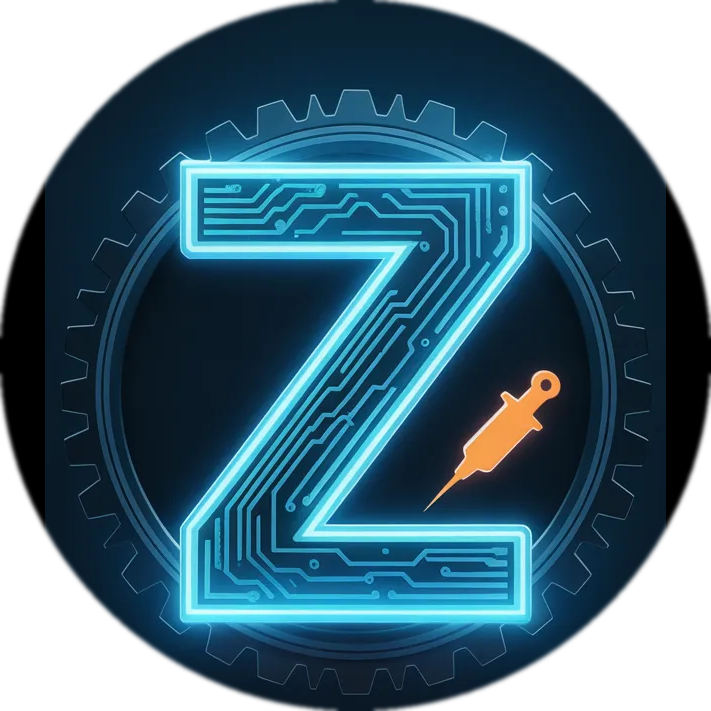

<div align="center">



# ZModManager

**A modern, open-source mod manager and injector for Unity games**

[](LICENSE)
[](https://dotnet.microsoft.com/)
[](https://github.com/TheHolyOneZ/ZModManager)
[](https://github.com/TheHolyOneZ/ZModManager)
[](https://zlogic.eu)

---

*Inject Mono assemblies at runtime. Deploy IL2CPP mods to MelonLoader, BepInEx or your own bootstrap — all from one clean dark UI.*

</div>

---

## Table of Contents

- [Features](#features)
- [How It Works](#how-it-works)
  - [Mono Games](#mono-games-direct-injection)
  - [IL2CPP Games](#il2cpp-games-framework-mediated)
- [Supported Frameworks](#supported-frameworks)
- [Screenshots](#screenshots)
- [Getting Started](#getting-started)
  - [Requirements](#requirements)
  - [Installation](#installation)
  - [Quick Start](#quick-start)
- [Building from Source](#building-from-source)
- [Project Structure](#project-structure)
- [Configuration](#configuration)
- [FAQ](#faq)
- [More Projects by TheHolyOneZ](#more-projects-by-theholyonez)
- [License](#license)

---

## Features

<table>
<tr>
<td width="50%">

**🎮 Game Management**
- Add unlimited game profiles
- Auto-detect Unity Mono vs. IL2CPP (+ Unreal, Godot)
- Per-game mod lists with enable/disable toggles
- Bulk enable / disable all mods at once
- Mod search & filter
- Optional launch arguments per game
- Open game folder directly from UI

</td>
<td width="50%">

**💉 Injection Engine**
- Direct x64 shellcode injection for Mono games
- Framework-mediated deployment for IL2CPP games
- Wait-for-window gate (no more "too early" crashes)
- Mono stabilization delay (waits for Assembly-CSharp)
- Compatible with MelonLoader, BepInEx 6 and ZModBootstrap
- Per-mod injection with individual success/fail results

</td>
</tr>
<tr>
<td>

**🛡️ Smart Compatibility**
- Auto-detects mod framework from DLL metadata (no loading)
- Warns when a mod targets the wrong framework (⚠ badge)
- Auto-disables incompatible mods before launch
- Three-phase framework status: Not Installed → Installing → Installed
- Blocks mismatched deploy (MelonLoader mod on BepInEx, etc.)

</td>
<td>

**⚙️ Framework Management**
- One-click install of MelonLoader or BepInEx 6 from GitHub
- Detects existing installations automatically
- Reinstall / uninstall without leaving the app
- ZModBootstrap: custom `version.dll` proxy for earliest injection
- Version badge after install

</td>
</tr>
<tr>
<td>

**🖥️ Modern UI**
- Custom dark WPF theme (no system chrome)
- Semi-transparent settings & about dialogs
- Minimize to system tray after launch
- Real-time injection log with copy button
- Game-running indicator in title bar
- DLL version tooltip on hover
- Mod notes field

</td>
<td>

**📦 Profile System**
- Export/import game profiles as JSON
- Settings persisted in `%AppData%\ZModManager\settings.json`
- Last selected game remembered across sessions
- Window position & size saved
- Per-session cancellable launch

</td>
</tr>
</table>

---

## How It Works

ZModManager routes mod loading through two completely different pipelines depending on the Unity build type it detects.

### Mono Games — Direct Injection

```
User clicks Launch
       │
       ▼
  Game process starts
       │
       ▼
  Wait: OS process appears   (30 s timeout)
       │
       ▼
  Wait: game window ≥ 200×150 px   (120 s timeout)
  ← prevents "too early" Mono domain errors
       │
       ▼
  Wait: mono.dll loaded in process   (30 s timeout)
       │
       ▼
  Stabilise 4 s   ← waits for Assembly-CSharp to finish loading
       │
       ▼
  Inject each enabled mod via x64 shellcode
```

The shellcode chain executed inside the target process:

| Step | Mono API called |
|------|----------------|
| 1 | `mono_get_root_domain()` |
| 2 | `mono_thread_attach(domain)` |
| 3 | `mono_domain_assembly_open(path)` |
| 4 | `mono_assembly_get_image()` |
| 5 | `mono_class_from_name(namespace, class)` |
| 6 | `mono_class_get_method_from_name(method, 0)` |
| 7 | `mono_runtime_invoke()` |

Export addresses are resolved by locally loading `mono.dll`, computing the offset against its base, then remapping to the remote base — no hardcoded addresses, works across Unity versions.

> [!NOTE]
> ZModManager handles all three Mono DLL variants automatically: `mono.dll`, `mono-2.0-bdwgc.dll` and `mono-2.0.dll`.

---

### IL2CPP Games — Framework-Mediated

IL2CPP games compile all managed code to native machine code — there is no Mono domain to inject into. Mods must be loaded by a native host framework before the game runs.

```
User clicks Launch
       │
       ▼
  Detect installed framework
  ┌────────────┬──────────────┬────────────────┐
  │ MelonLoader│   BepInEx 6  │ ZModBootstrap  │
  └─────┬──────┴──────┬───────┴───────┬────────┘
        ▼             ▼               ▼
  Copy mods to   Copy mods to   Write mods.cfg
  /Mods/         /BepInEx/      (config-driven)
                 plugins/
       │
       ▼
  Launch game — framework loads mods on startup
```

> [!IMPORTANT]
> For IL2CPP games you **must** have at least one framework installed. Use the Install buttons in the IL2CPP panel, or install MelonLoader / BepInEx manually first.

**Mod sync is automatic:** every time you click Launch, enabled mods are copied in and disabled mods are removed from the framework folder. What's in the folder always exactly matches your enabled list.

---

## Supported Frameworks

| Framework | Detection | Mod Folder | Mod Type | Install |
|-----------|-----------|------------|----------|---------|
| **MelonLoader** | `MelonLoader/` directory | `<game>/Mods/` | Managed .NET | ✅ Auto |
| **BepInEx 6** | `BepInEx/core/BepInEx*.dll` | `<game>/BepInEx/plugins/` | Managed .NET | ✅ Auto |
| **ZModBootstrap** | `ZModManager/zmodmanager.marker` | Config-driven | **Native DLL only** | ✅ Auto |

> [!TIP]
> **Which framework should I use?**
> - Most IL2CPP mods target **MelonLoader** — install it unless you have a reason not to.
> - **BepInEx 6** is the alternative; some mods target it instead.
> - **ZModBootstrap** is ZModManager's built-in fallback. Use it only for native (C++) mods when you have no other framework.

---

## Screenshots

> Screenshots will be added here. Run the app and take them!

<!--
  Suggested shots:
  - Main window with a game selected + mods list
  - IL2CPP panel with green "Installed" badge
  - ⚠ compatibility warning on a mod row
  - Settings dialog
  - About / More Tools dialog
-->

---

## Getting Started

### Requirements

| Component | Version |
|-----------|---------|
| **OS** | Windows 10 / 11 (x64) |
| **.NET Desktop Runtime** | 8.0 or later |
| **Games** | Unity (Mono or IL2CPP) |
| **Privileges** | Administrator (required for `CreateRemoteThread`) |

> [!CAUTION]
> ZModManager allocates executable memory in remote processes and calls `CreateRemoteThread`. **Run it as Administrator**, otherwise injection will silently fail.

---

### Installation

1. Go to [**Releases**](https://github.com/TheHolyOneZ/ZModManager/releases) and download the latest `ZModManager.zip`.
2. Extract anywhere (no installer required).
3. Run `ZModManager.exe` as Administrator.

> [!NOTE]
> If Windows SmartScreen blocks the executable, click **More info → Run anyway**. ZModManager is not code-signed yet.

---

### Quick Start

**Adding your first game:**

1. Click **+ Add Game** in the sidebar.
2. Browse to your game's `.exe` file.
3. ZModManager auto-detects whether it's a Mono or IL2CPP game.

**Adding a mod (Mono game):**

1. Select your game profile.
2. Click **+ Add Mod**.
3. Browse to the mod `.dll`.
4. Set the **Namespace**, **Class** and **Method** (the parameterless static entry point).
5. Click **Save**.

**Adding a mod (IL2CPP game):**

1. If no framework is shown as installed, click **Install MelonLoader** or **Install BepInEx**.
2. Click **+ Add Mod** and browse to the mod `.dll`.
3. ZModManager auto-detects whether it's a MelonLoader or BepInEx mod and warns you if it doesn't match.

**Launching:**

- Click **Launch** — for Mono games this injects all enabled mods; for IL2CPP it deploys mods then starts the game.
- Click **▷ No Mods** to launch the game clean (removes all deployed mods first).

> [!TIP]
> Enable **Minimize to tray after launch** in Settings (⚙) to keep ZModManager running in the background while you play. Double-click the tray icon to reopen it.

---

## Building from Source

### Prerequisites

| Tool | Purpose |
|------|---------|
| [Visual Studio 2022](https://visualstudio.microsoft.com/) | C++ and C# build |
| **Desktop development with C++** workload | For `ZModManager.Bootstrap` |
| **.NET 8.0 SDK** | For the main C# app |
| **Windows 10 SDK** | For native Windows headers |

### Steps

**1. Clone the repository**

```bash
git clone https://github.com/TheHolyOneZ/ZModManager.git
cd ZModManager
```

**2. Build the C++ Bootstrap DLL** *(required for ZModBootstrap support)*

```bash
build_bootstrap.bat
# or manually:
msbuild ZModManager.sln /p:Configuration=Release /p:Platform=x64 /t:"ZModManager_Bootstrap:Rebuild"
```

This produces `ZModManager/Resources/Bootstrap/version.dll` which is embedded as a managed resource in the final executable.

> [!NOTE]
> If you skip this step the app still builds and runs — ZModBootstrap install will be disabled with a user-friendly error. MelonLoader and BepInEx support is unaffected.

**3. Build the C# application**

```bash
dotnet build ZModManager/ZModManager.csproj --configuration Release
# Output: ZModManager/bin/Release/net8.0-windows/ZModManager.exe
```

Or open `ZModManager.sln` in Visual Studio and **Build → Build Solution**.

---

## Project Structure

```
ZModManager/
│
├── ZModManager/                    # Main WPF application (C# / .NET 8)
│   ├── Converters/                 # WPF value converters
│   ├── Injection/                  # Core injection engine
│   │   ├── MonoInjector.cs         # x64 shellcode injection for Mono
│   │   ├── DllInjector.cs          # LoadLibraryW injection for IL2CPP
│   │   ├── ModuleScanner.cs        # Remote module enumeration
│   │   └── ProcessMemory.cs        # Remote memory allocation wrapper
│   ├── Models/                     # Data models (GameProfile, ModEntry, etc.)
│   ├── Services/                   # Business logic
│   │   ├── BootstrapService.cs     # Framework detection, mod sync, install
│   │   ├── LaunchAndInjectService.cs  # Main launch orchestrator
│   │   ├── ModFrameworkDetector.cs    # DLL metadata inspection (no loading)
│   │   ├── FrameworkInstallerService.cs  # GitHub download + install
│   │   ├── RuntimeDetector.cs      # Mono vs IL2CPP detection
│   │   └── EngineAnalyzer.cs       # Unity/Unreal/Godot detection
│   ├── ViewModels/                 # MVVM view models
│   ├── Resources/
│   │   ├── DarkTheme.xaml          # Global WPF styles and palette
│   │   └── Bootstrap/version.dll  # Embedded C++ bootstrap (built separately)
│   ├── app_icon.ico / .png         # Application icon
│   ├── MainWindow.xaml             # Main UI
│   ├── SettingsWindow.xaml         # Settings dialog
│   └── AboutWindow.xaml            # About / More Projects dialog
│
├── ZModManager.Bootstrap/          # Native C++ DLL (version.dll proxy)
│   └── dllmain.cpp                 # DLL_PROCESS_ATTACH mod loader + export forwarder
│
├── ZModManager.sln
├── LICENSE
└── README.md
```

---

## Configuration

Settings are stored in `%AppData%\ZModManager\settings.json`.

| Setting | Default | Description |
|---------|---------|-------------|
| `ConfirmBeforeLaunch` | `false` | Show a Yes/No dialog before launching |
| `MinimizeToTray` | `true` | Hide window to system tray after launch |
| `AutoDisableIncompat` | `true` | Disable mods incompatible with the installed framework before launch |
| `DefaultIL2CPPFramework` | `MelonLoader` | Preferred framework when installing for a new game |
| `AutoDetectRuntime` | `true` | Auto-detect Mono vs IL2CPP on game exe selection |

> [!TIP]
> All of these are also available from the **⚙ Settings** button in the title bar — no need to edit JSON manually.

---

## FAQ

<details>
<summary><b>Injection failed — what do the error codes mean?</b></summary>

For Mono injection, the shellcode returns a numeric error code:

| Code | Meaning |
|------|---------|
| 1 | `mono_get_root_domain()` returned NULL |
| 2 | `mono_thread_attach()` failed |
| 3 | `mono_domain_assembly_open()` failed — DLL path wrong or file missing |
| 4 | `mono_assembly_get_image()` failed |
| 5 | `mono_class_from_name()` failed — Namespace or ClassName wrong |
| 6 | `mono_class_get_method_from_name()` failed — MethodName wrong or not parameterless |

</details>

<details>
<summary><b>The game launched but my mod didn't load (IL2CPP)</b></summary>

1. Check the **⚠ warning badge** on the mod — it means the mod targets a different framework than the one installed.
2. Verify the mod DLL is built for the framework you have installed (inspect its assembly references).
3. Make sure the mod is **enabled** (the toggle checkbox is on).
4. Check the injection log for deploy errors.

</details>

<details>
<summary><b>Why does ZModManager need Administrator?</b></summary>

Mono injection uses `VirtualAllocEx` + `WriteProcessMemory` + `CreateRemoteThread` — all of which require the injector process to have `PROCESS_ALL_ACCESS` on the target. This is a Windows security requirement, not something we can work around.

</details>

<details>
<summary><b>Can I use this with non-Unity games?</b></summary>

The Mono injection path works with **any** application embedding a Mono runtime (not just Unity). The IL2CPP path is Unity-specific. Unreal Engine and Godot games are detected and a warning is shown.

</details>

<details>
<summary><b>Where are my profiles saved?</b></summary>

`%AppData%\ZModManager\settings.json` — this is `C:\Users\<you>\AppData\Roaming\ZModManager\settings.json`. You can export individual profiles to JSON via **Profile → Export** and share them with others.

</details>

---

## More Projects by TheHolyOneZ

<table>
<tr>
<td width="33%" align="center">

### 🎮 [ZLogic.eu](https://zlogic.eu)
**Free Mod Menu Portal**

Browse and download free, regularly updated mod menus for 10+ PC games.
HollowKnight · PEAK · Subnautica · Raft · and more.

*Trusted by 5,800+ downloads*

</td>
<td width="33%" align="center">

### 💉 [SharpMonoInjector TheHolyOneZ Edition](https://github.com/TheHolyOneZ/SharpMonoInjector-2.7-TheHolyOneZ-Edition-)
**Advanced Mono Injector**

Modern GUI Mono injector with stealth mode, hot-reload, profile system and assembly inspector.
Built for power users and security researchers.

</td>
<td width="33%" align="center">

### 🤖 [Zoryx Discord Bot Framework](https://zsync.eu/zdbf/)
**Production-Ready Discord Bot Framework**

Python framework for advanced Discord bots.
Hot-reload extensions · per-guild SQLite · web monitoring dashboard · AI assistant.

[GitHub](https://github.com/TheHolyOneZ/discord-bot-framework) · [Website](https://zsync.eu/zdbf/)

</td>
</tr>
</table>

---

## Contributing

Pull requests are welcome. For major changes please open an issue first to discuss what you'd like to change.

1. Fork the repository
2. Create a feature branch (`git checkout -b feature/my-feature`)
3. Commit your changes
4. Open a Pull Request

> [!NOTE]
> If you add support for a new Unity Mono variant, a new framework, or a new injection technique, please include a brief description in the PR of how you tested it and what game/version you used.

---

## Disclaimer

> [!WARNING]
> ZModManager injects code into running processes. Use it only with games you own and only in single-player or offline modes. Using mods in online games may violate the game's Terms of Service and result in bans. The author is not responsible for any damage, bans, or data loss resulting from the use of this software.

---

## License

This project is licensed under the **MIT License** — see [LICENSE](LICENSE) for details.

```
MIT License — Copyright (c) 2026 TheHolyOneZ
```

You are free to use, modify and distribute this software. Attribution appreciated but not required.

---

<div align="center">

Made with ♥ by **[TheHolyOneZ](https://github.com/TheHolyOne)** &nbsp;|&nbsp; [ZLogic.eu](https://zlogic.eu) &nbsp;|&nbsp; [GitHub](https://github.com/TheHolyOneZ)

</div>
